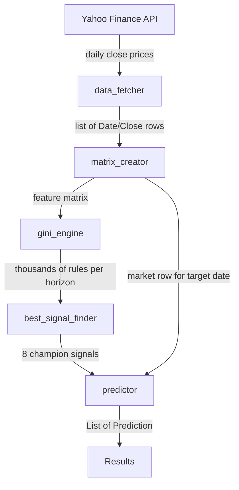

# Pure Python Quant

A rule-based quantitative trading signal discovery system written entirely in Python. The project downloads historical stock prices, engineers technical indicators, exhaustively searches for multi-condition trading rules, selects the best-performing signals, and generates live predictions for any given trading day.

There is no machine learning framework dependency — the core idea is **interpretable rule discovery**: find combinations of technical indicator conditions (e.g. `RSI > 70 AND Direction == 1`) that historically predicted price movement with high win rates.

---

## Table of Contents

- [Purpose](#purpose)
- [How It Works](#how-it-works)
- [Pipeline Overview](#pipeline-overview)
- [Project Structure](#project-structure)
- [Module Reference](#module-reference)
- [Data Models](#data-models)
- [Technical Indicators](#technical-indicators)
- [Prediction Horizons](#prediction-horizons)
- [Installation](#installation)
- [Quick Start](#quick-start)
- [Running Individual Modules](#running-individual-modules)
- [Backend Integration](#backend-integration)
- [Understanding Results](#understanding-results)
- [Design Notes](#design-notes)
- [Limitations and Disclaimers](#limitations-and-disclaimers)
- [Troubleshooting](#troubleshooting)

---

## Purpose

Financial markets produce large amounts of structured price data. This project answers a specific question:

> **Given today's technical indicator values, are there historically reliable multi-condition rules that suggest the price will move up or down over the next 3, 90, 180, or 365 days?**

Instead of training a black-box model, the system:

1. Computes well-known technical indicators from daily close prices.
2. Defines forward-looking target variables (did price go up or down? by how much?).
3. Searches all feature combinations and threshold values to find rules with strong historical performance.
4. Selects a small set of **champion** rules per horizon and direction.
5. Checks whether those champion rules fire on a specific date you care about.

The output is a list of human-readable predictions with probability, expected move, and the exact conditions that triggered.

---

## How It Works

The system operates in five stages. When you run `engine.py`, all stages execute **in memory** — no intermediate JSON files are written unless you run a module directly for debugging.



### Stage 1 — Data Fetching

Downloads historical daily closing prices from Yahoo Finance via the `yfinance` library. Each row becomes `{ "Date": "YYYY-MM-DD", "Close": 123.45 }`.

### Stage 2 — Feature Engineering

Transforms raw prices into 11 technical indicator features and 8 target columns (4 binary direction targets + 4 percentage change targets). Rows with insufficient history for indicators are dropped; recent rows where future targets are unknown are kept so live prediction on the latest data is possible.

### Stage 3 — Rule Discovery (Gini Engine)

Uses the first 80% of the matrix chronologically as training data. For each of four prediction horizons, it:

- Finds optimal single-feature thresholds (bullish and bearish).
- Generates all multi-feature combinations (2 features, 3 features, … up to all 11).
- Evaluates every threshold combination and keeps the one with the highest win rate (minimum 10 historical matches required).
- Produces thousands of candidate rules per horizon.

### Stage 4 — Champion Selection

From the discovered rules, filters by minimum win rate, support count, and profit thresholds (different per horizon). Ranks survivors and picks one **champion** bullish and one **champion** bearish signal per horizon — 8 champions total.

### Stage 5 — Live Prediction

Looks up the market data row for your target date. For each champion, checks whether **all** of its rule conditions are satisfied. If they are, a `Prediction` object is returned with direction, probability, expected change, and matched rules.

---

## Pipeline Overview

| Step | Module | Input | Output |
|------|--------|-------|--------|
| 1 | `data_fetcher.py` | ticker, date range | list of `{Date, Close}` |
| 2 | `matrix_creator.py` | raw price data | feature matrix (list of dicts) |
| 3 | `gini_engine.py` | feature matrix | dict of rules per horizon |
| 4 | `best_signal_finder.py` | rule lists | 8 champion `Value` objects |
| 5 | `predictor.py` | matrix + champions + date | `List[Prediction]` |
| **All** | `engine.py` | ticker + date | `List[Prediction]` |

---

## Project Structure

```
pure-python-quant/
├── engine.py              # Main entry point — runs full pipeline in memory
├── data_fetcher.py        # Downloads price data from Yahoo Finance
├── matrix_creator.py      # Feature engineering and target variables
├── gini_engine.py         # Exhaustive rule discovery
├── best_signal_finder.py  # Filters and selects champion signals
├── predictor.py           # Evaluates champions against a specific date
├── classes.py             # Core data models (Rule, Value, Prediction)
├── test_creator.py        # Train/test split utility (80/20 chronological)
├── README.md
└── LICENSE
```

When modules are run standalone for debugging, they may write files under `{ticker}_ticker/` (e.g. `aapl_ticker/data.json`). These folders are gitignored. The main `engine.py` path never writes to disk.

---

## Module Reference

### `engine.py` — Unified Orchestrator

The recommended entry point for production and backend use.

```python
from engine import engine

predictions = engine("aapl", "2026-06-03")
# returns List[Prediction]
```

**CLI:**

```bash
python engine.py aapl                  # uses today's date
python engine.py aapl 2026-06-03        # explicit date
```

Fetches data from 2020-01-01 through the day after the target date. Runs the entire pipeline in memory and prints results. Does not write JSON files.

---

### `data_fetcher.py` — Market Data

| Function | Description |
|----------|-------------|
| `fetch_data(ticker, start_date, end_date)` | Download and parse Yahoo Finance data |
| `download_data(...)` | Raw pandas DataFrame from yfinance |
| `parse_data(dataframe)` | Convert to list of dicts |

**Standalone:** prompts for a ticker, downloads from 2020-01-01 to today, saves `{ticker}_ticker/data.json`.

---

### `matrix_creator.py` — Feature Engineering

| Function | Description |
|----------|-------------|
| `build_feature_matrix(raw_data)` | Run full indicator + target pipeline, return matrix |

Applies in order: price direction → SMA ratios & crossovers → MACD → RSI → all target variables → row cleaning.

**Standalone:** loads `{ticker}_ticker/data.json`, builds matrix, saves `{ticker}_ticker/matrix.json`.

---

### `gini_engine.py` — Rule Discovery

| Function | Description |
|----------|-------------|
| `gini_engine(matrix)` | Discover rules for all horizons, return in-memory dict |
| `get_best_single_thresholds(...)` | Optimal per-feature thresholds |
| `select_combinations(...)` | Generate feature combinations |
| `evaluate_combination_set(...)` | Score a rule combination by win rate |

**Standalone:** loads `{ticker}_ticker/matrix.json`, runs discovery, saves `Target.json`, `Target_90.json`, `Target_180.json`, and `Target_365.json`. Console output example: `[Target] Testing...`, `[Target] Results saved to Target.json.`

---

### `best_signal_finder.py` — Champion Selection

| Function | Description |
|----------|-------------|
| `finder(target_list, target_90_list, ...)` | Select 8 champions from in-memory rule lists |
| `finder_from_ticker(ticker)` | Load rules from disk, then call `finder()` |
| `gini_output_to_values(gini_output)` | Convert gini dict to `List[Value]` |
| `filter_signals(...)` | Filter by win rate, support, profit |
| `find_champion(signals, signal_type)` | Pick single best signal from candidates |

**Standalone:** loads rule JSON files for a ticker and prints champions.

---

### `predictor.py` — Live Prediction

| Function | Description |
|----------|-------------|
| `generate_predictions(ticker, date, matrix, champions)` | Return triggered predictions |
| `get_market_data_for_date(matrix, date)` | Look up one day's row |
| `evaluate_rule(rule, row_data)` | Test a single condition |

**Standalone:** loads matrix and champions from disk, runs prediction for a hardcoded test date.

---

### `classes.py` — Data Models

Defines the shared types used across the pipeline. See [Data Models](#data-models) below.

---

### `test_creator.py` — Train/Test Split

| Function | Description |
|----------|-------------|
| `create_test_data(matrix, day="Target")` | 80/20 chronological split into feature vectors and labels |

Used for optional model evaluation workflows. The Gini Engine applies its own 80% train split internally.

---

## Data Models

### `Rule`

A single condition in a trading signal.

```python
Rule(feature="RSI", threshold=70.0, operation=">")
# means: RSI > 70
```

Supported operations: `==`, `<=`, `>=`, `<`, `>`.

### `Value`

A complete discovered signal with performance metrics.

| Field | Description |
|-------|-------------|
| `day` | Prediction horizon (3, 90, 180, or 365) |
| `type` | `Type.HIGH` (bullish) or `Type.LOW` (bearish) |
| `combination` | Feature names used in this signal |
| `win_rate` | Historical success rate (0.0–1.0) |
| `support` | Number of historical days the rule matched |
| `percentage_profit` | Average price change when rule fired |
| `which_day_is_higher` | Average day target was first met (3-day only) |
| `rules` | List of `Rule` objects (all must be true — AND logic) |

### `Prediction`

A live signal triggered on a specific date.

| Field | Description |
|-------|-------------|
| `ticker` | Stock symbol |
| `date` | Evaluation date |
| `signal_type` | `"HIGH"` or `"LOW"` |
| `probability` | Capped at 80% (`min(win_rate, 0.8)`) |
| `expected_change_pct` | Expected percentage move |
| `expected_days` | Time horizon |
| `rules_matched` | Human-readable list of satisfied conditions |

---

## Technical Indicators

All indicators are computed from daily **close prices only**.

| Feature | Description |
|---------|-------------|
| `Direction` | Previous-day close comparison: `1` up, `-1` down, `0` flat |
| `SMA_20_Ratio` | `(Close - SMA_20) / SMA_20` — normalized distance from 20-day SMA |
| `SMA_50_Ratio` | Same for 50-day SMA |
| `SMA_100_Ratio` | Same for 100-day SMA |
| `SMA_200_Ratio` | Same for 200-day SMA |
| `Cross_20_50` | `1` if SMA_20_Ratio > SMA_50_Ratio, else `0` |
| `Cross_50_100` | `1` if SMA_50_Ratio > SMA_100_Ratio, else `0` |
| `Cross_100_200` | `1` if SMA_100_Ratio > SMA_200_Ratio, else `0` |
| `MACD_Line` | EMA(12) − EMA(26) |
| `MACD_Signal` | 9-day EMA of MACD_Line |
| `RSI` | 14-day Relative Strength Index (Wilder smoothing) |

SMA ratios are normalized to avoid look-ahead bias and make thresholds comparable across price levels.

---

## Prediction Horizons

The system evaluates four forward-looking targets:

| Horizon | Binary Target | Percentage Target | Forward Window |
|---------|---------------|-------------------|----------------|
| 3-day | `Target` | `Target_Day_Percentage_Change` | Next 3 trading days |
| 90-day | `Target_90` | `Target_90Day_Percentage_Change` | Days 85–94 average |
| 180-day | `Target_180` | `Target_180Day_Percentage_Change` | Days 170–189 average |
| 365-day | `Target_365` | `Target_365Day_Percentage_Change` | Days 350–379 average |

**Binary target logic (3-day):** `Target = 1` if any of the next 3 days' close exceeds today's close; otherwise `0`.

**Longer horizons:** Compare today's close to the average close over a window centered near the horizon day.

Champion selection thresholds differ per horizon (e.g. 3-day bullish requires 95% win rate; 180-day allows 80%).

---

## Installation

**Requirements:** Python 3.10+ recommended

```bash
git clone <repository-url>
cd pure-python-quant

python -m venv venv

# Windows
venv\Scripts\activate

# macOS / Linux
source venv/bin/activate

pip install yfinance
```

The only third-party dependency is `yfinance`. All other imports are from the Python standard library.

---

## Quick Start

Run the full pipeline for Apple on a specific date:

```bash
python engine.py aapl 2026-06-03
```

Example output:

```
Running pipeline for AAPL...
================================ Gini Engine Master =================================

[Target] Testing...
[Target] 2640 rules discovered.
...
----------------------------------------------------------------------
Found 1 active trading signals for 2026-06-03:
[2026-06-03] AAPL | 180-Day Outlook | Signal: Bearish (-) | Prob: 80.0% | Expected Move: -10.19%
   Conditions met: Rule(Feature: Direction, Threshold: -1), Rule(Feature: SMA_20_Ratio, Threshold: 0.013), ...
----------------------------------------------------------------------
```

Run for today (must be a trading day with available data):

```bash
python engine.py msft
```

---

## Running Individual Modules

Each module can be run independently for debugging. **Only these standalone runs write JSON files to disk.**

| Command | What it does | Output files |
|---------|--------------|--------------|
| `python data_fetcher.py` | Download price data | `{ticker}_ticker/data.json` |
| `python matrix_creator.py` | Build feature matrix | `{ticker}_ticker/matrix.json` |
| `python gini_engine.py` | Discover trading rules | `{ticker}_ticker/Target*.json` |
| `python best_signal_finder.py` | Print champion signals | (read-only) |
| `python predictor.py` | Test prediction on a date | (read-only) |

Typical debug workflow:

```bash
python data_fetcher.py       # enter ticker when prompted
python matrix_creator.py     # uses aapl_ticker/data.json by default
python gini_engine.py        # uses aapl_ticker/matrix.json by default
python best_signal_finder.py
python predictor.py
```

Or skip straight to the unified path:

```bash
python engine.py aapl 2026-06-03
```

---

## Backend Integration

Import and call `engine()` from your server code:

```python
from engine import engine

def get_signals(ticker: str, date: str | None = None):
    predictions = engine(ticker, date)
    return [
        {
            "ticker": p.ticker,
            "date": p.date,
            "signal_type": p.signal_type,
            "probability": p.probability,
            "expected_change_pct": p.expected_change_pct,
            "expected_days": p.expected_days,
            "rules_matched": p.rules_matched,
        }
        for p in predictions
    ]
```

**Notes for server deployment:**

- Each call re-fetches data and re-runs rule discovery (~25–30 seconds for a typical ticker). Consider caching if latency matters.
- No files are written during `engine()` calls — safe for containerized or read-only filesystem environments.
- Network access to Yahoo Finance is required at runtime.
- `engine()` raises `ValueError` if no market data is returned for the ticker.

---

## Understanding Results

### No predictions returned

This is normal and means none of the 8 champion rules matched on that date. Possible reasons:

- Market conditions did not satisfy all conditions in any champion rule.
- The date is a weekend or holiday (no trading row in the matrix).
- The date is too recent and indicators could not be computed (need ~200 days of history for SMA_200).

### Multiple predictions

You may receive more than one prediction if champions from different horizons (e.g. 3-day and 180-day) all fire on the same day. Each has its own horizon and expected move.

### Probability cap

Displayed probability is capped at 80% even if historical win rate was 99%+. This avoids over-confidence from small-sample or overfit rules.

### Signal direction

| Signal | Meaning |
|--------|---------|
| `HIGH` / Bullish (+) | Historical rule suggests upward price movement |
| `LOW` / Bearish (-) | Historical rule suggests downward price movement |

---

## Design Notes

### In-memory pipeline

`engine.py` passes data between stages as Python objects (lists and dicts). JSON files exist only when you run individual modules directly — useful for inspecting intermediate results without re-running the full pipeline.

### Chronological train split

The Gini Engine trains on the earliest 80% of rows and never shuffles. This respects the time-series nature of market data and reduces look-ahead bias compared to random splits.

### Exhaustive search

Rule discovery tests all feature combinations and threshold pairings. This is interpretable but computationally expensive — expect ~25–30 seconds per `engine()` call.

### AND logic for rules

Every condition in a `Value` must be true simultaneously for the signal to fire. There is no OR logic between rules within a single signal.

---

## Limitations and Disclaimers

- **Not financial advice.** This is a research and educational tool. Past performance of discovered rules does not guarantee future results.
- **Survivorship and overfitting risk.** Rules are optimized on historical data. High win rates on training data may not hold out-of-sample.
- **Single data source.** Prices come from Yahoo Finance only. Data quality and corporate actions depend on yfinance.
- **Close prices only.** No volume, intraday data, or fundamental metrics are used.
- **US market hours implied.** Dates must match trading days in the downloaded data.
- **No transaction costs.** Reported profits are gross percentage moves, not net of fees or slippage.

---

## Troubleshooting

| Problem | Likely cause | Solution |
|---------|--------------|----------|
| `ValueError: No market data returned` | Invalid ticker or network issue | Check ticker symbol and internet connection |
| `No market data found for AAPL on YYYY-MM-DD` | Weekend, holiday, or future date | Use a valid past trading day |
| `No champion trading signals were triggered` | No champion rules matched | Normal — not every day produces a signal |
| Slow execution (~30s) | Full rule discovery runs every call | Expected; consider caching for production |
| `ModuleNotFoundError: yfinance` | Missing dependency | Run `pip install yfinance` |
| Empty matrix / very few rows | Not enough historical data | Ensure start date is early enough (default: 2020-01-01) |

---

## License

See [LICENSE](LICENSE) for license terms.
